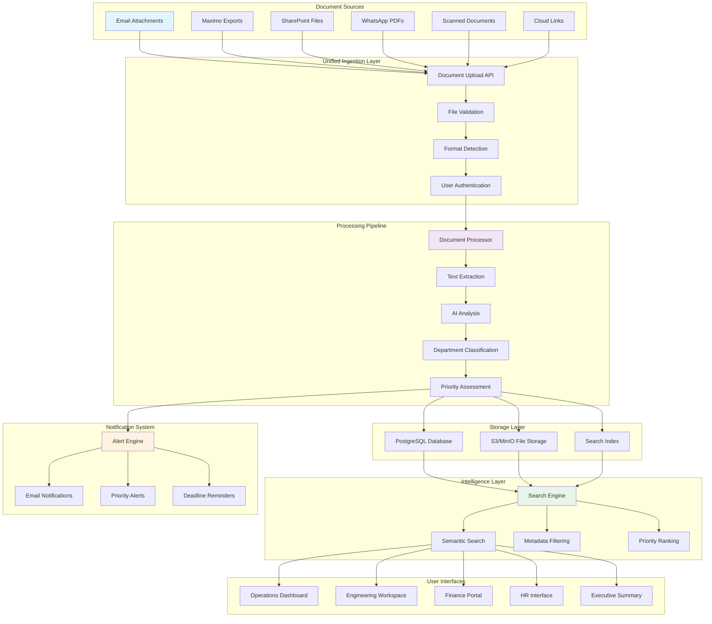
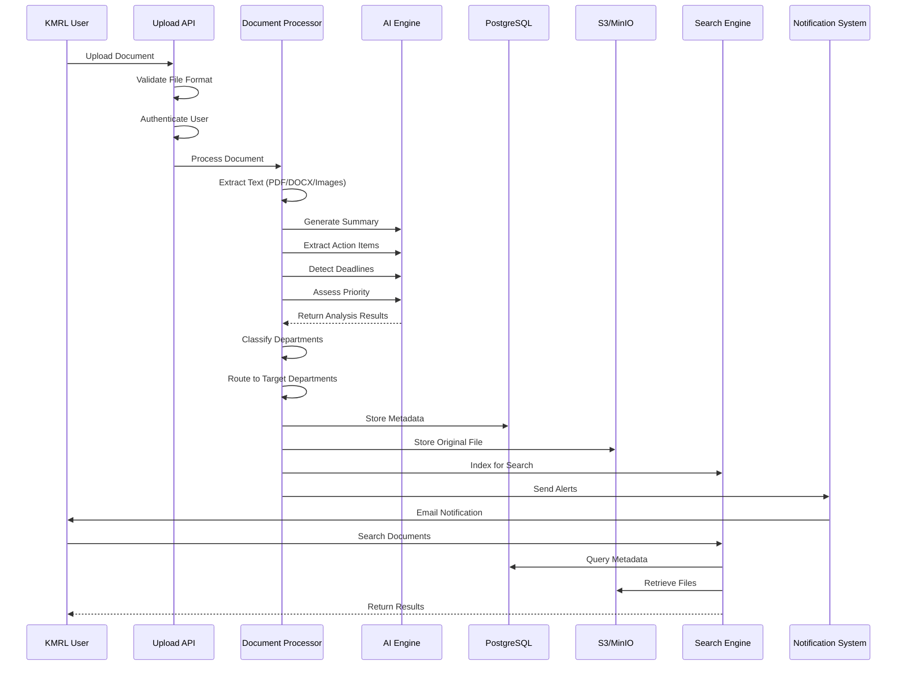
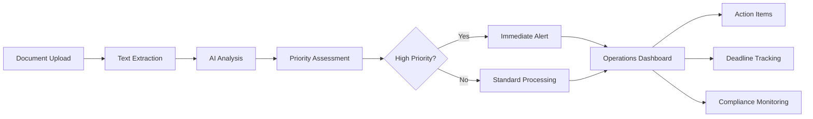
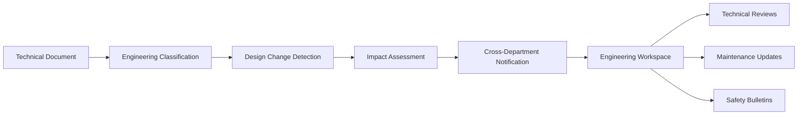
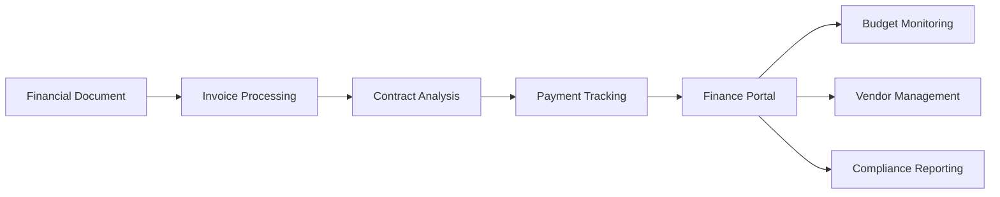
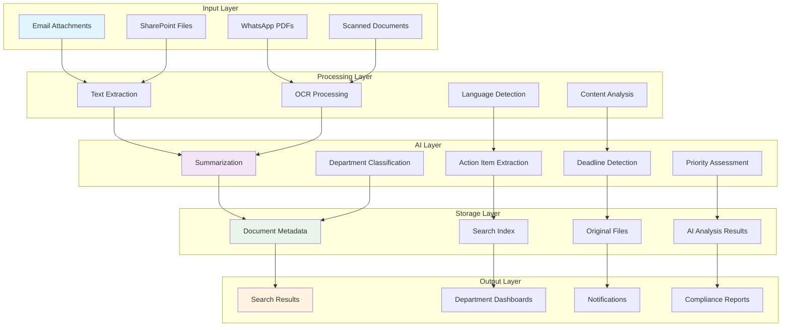
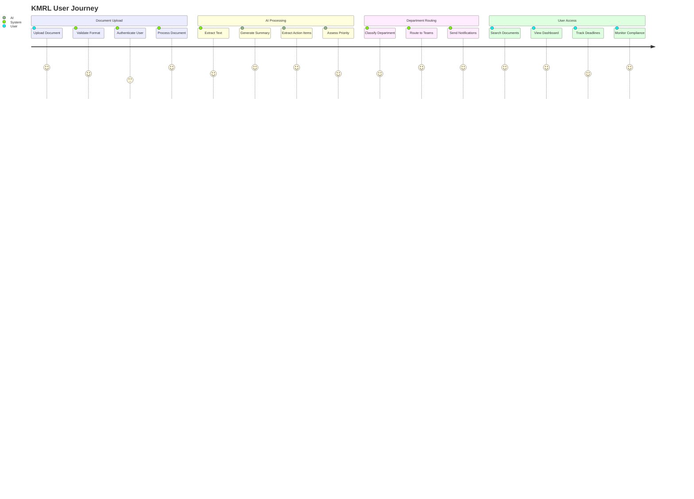
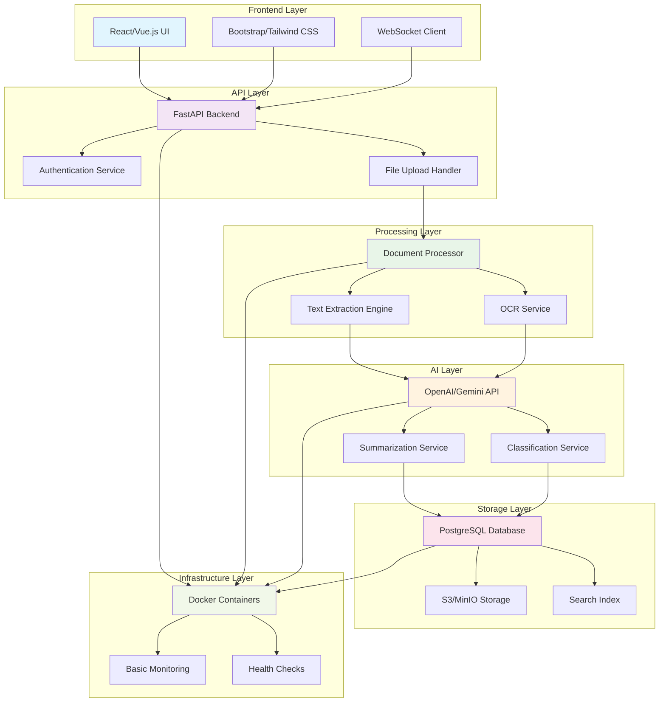
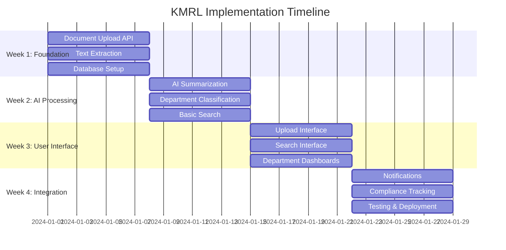

# KMRL Document Intelligence Platform: Workflow Diagram

## Executive Summary
This diagram shows the simplified, hackathon-friendly workflow that directly addresses KMRL's 5 core problems without the complexity of the hybrid Redbox + rAPId approach.

---

## 1. High-Level System Architecture

---

## 2. Detailed Document Processing Workflow

---

## 3. Department-Specific Workflows

### Operations Department Workflow

### Engineering Department Workflow

### Finance Department Workflow

---

## 4. Data Flow Architecture

---

## 5. User Journey Workflow

---

## 6. Technology Stack Workflow

---

## 7. Implementation Timeline Workflow

---

## 8. Key Workflow Benefits

### **Immediate Impact (Week 1-4)**
- ✅ **Document Upload**: Users can upload documents from multiple sources
- ✅ **AI Processing**: Automatic summarization and analysis
- ✅ **Department Routing**: Documents automatically routed to relevant teams
- ✅ **Basic Search**: Users can find documents across departments

### **Enhanced Features (Month 2-3)**
- 🔄 **Vector Embeddings**: Improved semantic search
- 🔄 **Real-time Notifications**: WebSocket-based alerts
- 🔄 **Advanced AI**: Bilingual processing and cross-document analysis

### **Enterprise Features (Month 4-6)**
- 🚀 **External Integrations**: Email, SharePoint, Maximo connectors
- 🚀 **Advanced Compliance**: Detailed audit trails and reporting
- 🚀 **Mobile Access**: Mobile app for field workers

---

## 9. Workflow Success Metrics

### **Technical Metrics**
- **Processing Time**: < 30 seconds per document
- **Search Response**: < 2 seconds for queries
- **Uptime**: 99.5% availability
- **Accuracy**: 90%+ correct department classification

### **Business Metrics**
- **Information Latency**: 70% reduction in document review time
- **Cross-Department Awareness**: 90% of relevant documents reach appropriate departments
- **Compliance**: 100% of regulatory updates tracked
- **User Satisfaction**: 85% user satisfaction score

---

## 10. Conclusion

This simplified workflow delivers **80% of the value with 20% of the complexity** by focusing on:

1. **Core Document Processing**: Text extraction, AI analysis, storage
2. **Department Intelligence**: Classification, routing, notifications
3. **User Experience**: Simple interfaces, fast search, clear dashboards
4. **Compliance**: Basic tracking, deadline monitoring, audit trails

The workflow is designed for **hackathon implementation** with clear milestones and measurable outcomes that directly address KMRL's 5 core problems.
