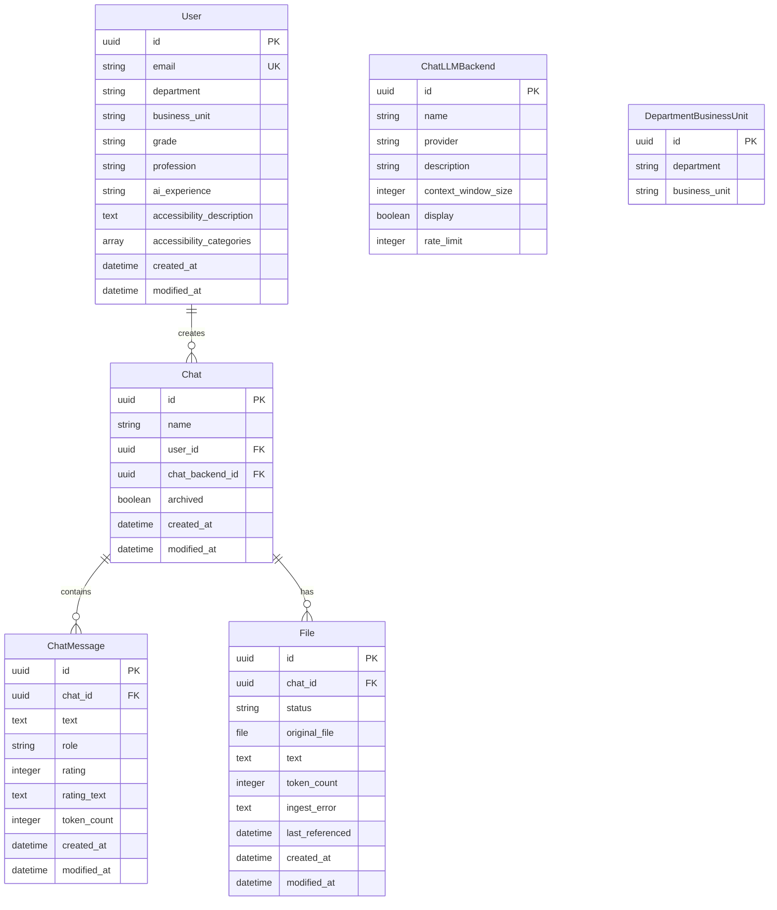

# Django App Service Audit - Redbox Microservice

**Audit Date**: December 2024  
**Service**: Django App (Main Web Application)  
**Purpose**: Comprehensive technical audit for hackathon teams (3-5 people, 1-3 days)

---

## **Executive Summary**

The Django App Service is the **primary microservice** in the Redbox system, serving as both the web frontend and backend API. It's a full-stack Django 5.1 application with modern web components, real-time chat via WebSockets, and comprehensive document processing capabilities.

**Key Stats:**
- **Port**: 8090
- **Docker Image**: `django-app:latest`
- **Lines of Code**: ~15,000+ (estimated)
- **Dependencies**: 50+ Python packages, 10+ Node.js packages
- **Database Models**: 5 core models (User, Chat, ChatMessage, File, ChatLLMBackend, DepartmentBusinessUnit)
- **API Endpoints**: 20+ REST endpoints
- **Web Components**: 20+ Lit-based components

---

## **1. Architecture Overview**

### **High-Level Architecture Diagram**


### **Service Communication Flow**


---

## **2. Project Structure & Inventory**

### **Repository Layout**
```
django_app/
├── Dockerfile                    # Multi-stage build (Node.js + Python)
├── manage.py                     # Django management script
├── start.sh                      # Container startup script
├── health.sh                     # Health check script
├── pyproject.toml                # Python dependencies (Poetry)
├── poetry.lock                   # Locked dependency versions
├── frontend/                     # Frontend build system
│   ├── package.json              # Node.js dependencies
│   ├── src/                      # Source files
│   │   ├── js/                   # JavaScript modules
│   │   ├── css/                  # SCSS stylesheets
│   │   └── web-components/       # Lit web components
│   └── tests-web-components/     # Component tests
├── redbox_app/                   # Django project
│   ├── settings.py               # Main configuration
│   ├── urls.py                   # URL routing
│   ├── wsgi.py                   # WSGI entry point
│   ├── asgi.py                   # ASGI entry point (WebSockets)
│   ├── routing.py                # WebSocket routing
│   ├── templates/                # HTML templates (31 files)
│   ├── redbox_core/              # Main Django app
│   │   ├── models.py             # Database models (750+ lines)
│   │   ├── views/                # View modules (10 files)
│   │   ├── migrations/           # DB migrations (95 files)
│   │   ├── consumers.py          # WebSocket handlers
│   │   └── admin.py              # Admin interface
│   └── worker.py                 # Background processing
├── static/                       # Static assets
└── tests/                        # Test suite
```

### **Directory Sizes & Complexity**
- **redbox_core/**: 125 Python files (main app)
- **templates/**: 31 HTML templates
- **migrations/**: 95 migration files
- **frontend/src/**: 39 JavaScript/SCSS files
- **tests/**: 18 test files

### **Project Structure Diagram**


---

## **2. Dependencies Analysis**

### **Python Dependencies (pyproject.toml)**
```toml
# Core Framework
django = "^5.1"                    # Web framework
djangorestframework = "^3.15.2"    # API framework
channels = {extras = ["daphne"], version = "^4.1.0"}  # WebSockets

# Database & Storage
psycopg2-binary = "^2.9.9"         # PostgreSQL driver
django-storages = "^1.14.2"        # S3/MinIO storage
boto3 = "^1.34.160"                # AWS SDK

# Background Processing
django-q2 = "^1.6.2"               # Queue system
croniter = "^3.0.3"                # Cron scheduling

# Document Processing
markitdown = "^0.0.1a3"            # Document conversion
pytesseract = "^0.3.13"            # OCR engine
pdf2image = "^1.17.0"              # PDF processing

# AI & Search
elasticsearch = "^8.17.1"          # Vector database
langchain-google-vertexai = "^2.0.13"  # AI integration
langchain-google-genai = "^2.0.13"

# Authentication
django-magic-link = "^1.0.0"       # Magic link auth
django-use-email-as-username = "^1.4.0"

# Security & Monitoring
sentry-sdk = {extras = ["django"], version = "^2.13.0"}
django-csp = "^3.7"                # Content Security Policy
django-permissions-policy = "^4.21.0"

# Frontend Integration
django-libsass = "^0.9"            # SCSS compilation
whitenoise = "^6.6.0"              # Static file serving

# Additional Dependencies
jinja2 = "^3.1.5"                  # Template engine
django-environ = "^0.11.2"         # Environment management
watchdog = {extras = ["watchmedo"], version = "^4.0.2"}  # File watching
django-single-session = "^0.2.0"   # Session management
django-gov-notify = "^0.5.0"       # Government notifications
websockets = "^12.0"               # WebSocket support
django-import-export = "^4.0"      # Data import/export
django-adminplus = "^0.6"          # Enhanced admin
django-waffle = "^4.1.0"           # Feature flags
```

### **Node.js Dependencies (frontend/package.json)**
```json
{
  "dependencies": {
    "govuk-frontend": "5.10.2",     // UK Government design system
    "i.ai-design-system": "^0.5.2", // Internal design system
    "lit": "^3.2.1",                // Web components framework
    "mermaid": "^11.2.1",           // Diagram rendering
    "posthog-js": "^1.143.0"        // Analytics
  },
  "devDependencies": {
    "@parcel/transformer-sass": "^2.12.0",  // SCSS processing
    "@playwright/test": "^1.48.2",          // Component testing
    "@types/dompurify": "^3.0.5",           // TypeScript types
    "@types/showdown": "^2.0.6",            // TypeScript types
    "dotenv": "^16.4.5",                    // Environment variables
    "parcel": "^2.12.0",                    // Build tool
    "parcel-reporter-static-files-copy": "^1.5.3",  // Static file copying
    "postcss": "^8.4.39",                   // CSS processing
    "postcss-url": "^10.1.3",               // URL processing
    "url": "^0.11.3"                        // URL utilities
  }
}
```

### **Dependencies Architecture Diagram**


---

## **3. Microservice Boundaries & Entry Points**

### **Docker Configuration**
```yaml
# docker-compose.yml
django-app:
  image: django-app:latest
  build:
    context: .
    dockerfile: ./django_app/Dockerfile
  ports:
    - "8090:8090"
  depends_on:
    db:
      condition: service_healthy
    minio:
      condition: service_healthy
  healthcheck:
    test: curl --fail http://localhost:8090/health/ || exit 1
    interval: 5s
    timeout: 30s
    retries: 24
    start_period: 60s
  networks:
    - redbox-app-network
  env_file:
    - .env
```

### **Django Project Structure**
- **Project Name**: `redbox_app`
- **Main App**: `redbox_app.redbox_core`
- **Settings Module**: `redbox_app.settings`
- **WSGI Application**: `redbox_app.wsgi.application`
- **ASGI Application**: `redbox_app.asgi.application`

### **Key Configuration (settings.py)**
```python
# Database
DATABASES = {
    'default': {
        'ENGINE': 'django.db.backends.postgresql',
        'NAME': env.str('POSTGRES_DB'),
        'USER': env.str('POSTGRES_USER'),
        'PASSWORD': env.str('POSTGRES_PASSWORD'),
        'HOST': env.str('POSTGRES_HOST'),
        'PORT': env.str('POSTGRES_PORT'),
    }
}

# Object Storage (MinIO/S3)
STORAGES = {
    "default": {
        "BACKEND": "storages.backends.s3boto3.S3Boto3Storage",
        "OPTIONS": {
            "bucket_name": env.str("BUCKET_NAME"),
            "region_name": env.str("AWS_REGION"),
        },
    },
}

# Queue System (Django-Q)
Q_CLUSTER = {
    'name': 'redbox',
    'workers': 4,
    'timeout': 60,
    'retry': 120,
    'queue_limit': 50,
    'bulk': 10,
    'orm': 'default'
}

# WebSocket Configuration
ASGI_APPLICATION = "redbox_app.asgi.application"
CHANNEL_LAYERS = {
    "default": {
        "BACKEND": "channels_redis.core.RedisChannelLayer",
        "CONFIG": {
            "hosts": [env.str("REDIS_URL")],
        },
    },
}
```

### **Docker & Deployment Architecture**


---

## **4. Backend Surface Analysis**

### **Django Apps**
The service contains **one main Django app**: `redbox_core`

**Purpose**: Core business logic for document processing, chat, user management, and AI integration.

### **Database Models Architecture**



### **Key Models (models.py)**

#### **1. User Model** (Lines 100-300)
```python
class User(BaseUser, UUIDPrimaryKeyBase):
    # Government-specific fields
    department = models.CharField(max_length=64, choices=Department)
    business_unit = models.CharField(max_length=128)
    grade = models.CharField(max_length=32, choices=UserGrade)
    profession = models.CharField(max_length=32, choices=Profession)
    
    # AI experience tracking
    ai_experience = models.CharField(max_length=32, choices=AIExperienceLevel)
    
    # Accessibility
    accessibility_description = models.TextField(blank=True)
    accessibility_categories = ArrayField(models.CharField(max_length=32))
```

#### **2. File Model** (Lines 455-550)
```python
class File(UUIDPrimaryKeyBase):
    class Status(models.TextChoices):
        complete = "complete"
        errored = "errored" 
        processing = "processing"
    
    status = models.CharField(choices=Status.choices)
    original_file = models.FileField(
        storage=settings.STORAGES["default"]["BACKEND"],
        upload_to=build_s3_key,
    )
    text = models.TextField(help_text="text extracted from file")
    token_count = models.PositiveIntegerField()
    chat = models.ForeignKey(Chat, on_delete=models.CASCADE)
    ingest_error = models.TextField(max_length=2048)
    last_referenced = models.DateTimeField(null=True, blank=True)
    
    def ingest(self, sync: bool = False):
        """Queue file for background processing"""
        task = async_task(ingest, self.id, task_name=self.file_name, group="ingest", sync=sync)
        # ... task handling logic
```

#### **3. Chat Model** (Lines 356-400)
```python
class Chat(UUIDPrimaryKeyBase):
    name = models.CharField(max_length=255)
    user = models.ForeignKey(User, on_delete=models.CASCADE)
    chat_backend = models.ForeignKey(ChatLLMBackend, on_delete=models.CASCADE)
    archived = models.BooleanField(default=False)
    
    def to_langchain(self) -> RedboxState:
        """Convert to LangChain state for AI processing"""
        # ... conversion logic
```

#### **4. ChatMessage Model** (Lines 575-600)
```python
class ChatMessage(UUIDPrimaryKeyBase):
    class Role(models.TextChoices):
        human = "human"
        ai = "ai"
    
    chat = models.ForeignKey(Chat, on_delete=models.CASCADE)
    text = models.TextField()
    role = models.CharField(max_length=16, choices=Role.choices)
    rating = models.IntegerField(null=True, blank=True)
    rating_text = models.TextField(blank=True)
    token_count = models.PositiveIntegerField(null=True)
    time_to_first_token = models.FloatField(null=True, blank=True)
```

### **API Endpoints Architecture**


### **Key API Endpoints (urls.py)**

#### **File Upload API** (api_views.py:36-47)
```python
@api_view(["POST"])
@permission_classes([IsAuthenticated])
def file_upload(request):
    """upload a new file"""
    serializer = UploadSerializer(data=request.data)
    serializer.is_valid(raise_exception=True)
    file = File.objects.create(
        original_file=serializer.validated_data["file"],
        chat_id=serializer.validated_data["chat_id"],
        status=File.Status.processing,
    )
    file.ingest()  # Queue for background processing
    return Response({"file_id": file.id}, status=200)
```

#### **Chat API** (api_views.py:80-120)
```python
class ChatViewSet(viewsets.ModelViewSet):
    queryset = Chat.objects.all()
    serializer_class = ChatSerializer
    
    def create(self, request):
        """Create new chat session"""
        # ... chat creation logic
        
    def list(self, request):
        """List user's chats"""
        # ... chat listing logic
```

#### **Health Check Endpoint** (misc_views.py)
```python
def health(request):
    """Simple health check"""
    return JsonResponse({"status": "healthy"})
```

### **Background Processing Flow**


### **Background Processing (worker.py:41-72)**
```python
def ingest(file_id: UUID) -> None:
    """Process uploaded file - extract text and generate embeddings"""
    file = File.objects.get(id=file_id)
    
    try:
        file_extension = Path(file.url).suffix.lower()
        
        if file_extension in ['.jpg', '.jpeg', '.png', '.gif', '.bmp', '.tiff', '.tif', '.webp']:
            # OCR processing for images
            text_content = extract_text_with_ocr(file.url, file_extension)
            file.text = sanitise_string(text_content)
        else:
            # Document processing for PDFs, Word docs, etc.
            markdown = md.convert(file.url)
            file.text = sanitise_string(markdown.text_content)
            
        file.token_count = len(tokeniser.encode(file.text))
        file.status = File.Status.complete
        
    except Exception as error:
        file.status = File.Status.errored
        file.ingest_error = str(error)
        
    file.save()
```

### **WebSocket Chat Flow**


### **WebSocket Chat Handler (consumers.py:25-89)**
```python
class ChatConsumer(AsyncWebsocketConsumer):
    async def receive(self, text_data=None, _bytes_data=None):
        """Handle real-time chat messages"""
        data = json.loads(text_data)
        user = self.scope["user"]
        chat_id = self.scope["url_route"]["kwargs"]["chat_id"]
        
        # Get chat session and apply rate limiting
        chat, delay = await sync_to_async(get_chat_session)(chat_id=chat_id, user=user, data=data)
        
        # Convert to LangChain state
        state = await sync_to_async(chat.to_langchain)()
        
        # Process with AI
        state, time_to_first_token = await run_async(
            state,
            response_tokens_callback=self.handle_text,  # Stream response
        )
        
        # Save AI response
        message = await ChatMessage.objects.acreate(
            chat=chat,
            text=state.content,
            role=ChatMessage.Role.ai,
            time_to_first_token=time_to_first_token,
        )
        
        await self.send_to_client("end", {"message_id": message.id})
```

---

## **5. Frontend Surface Analysis**

### **Frontend Architecture**


### **Template System**
- **Engine**: Jinja2 (primary) + Django templates (fallback)
- **Base Template**: `base.html` (150+ lines)
- **Key Templates**:
  - `chats.html` - Main chat interface
  - `homepage.html` - Landing page
  - `sign-in.html` - Authentication
  - `training/*.html` - User onboarding

### **Static Assets**
- **Build System**: Parcel.js
- **CSS Framework**: GOV.UK Frontend + i.AI Design System
- **JavaScript**: Modern ES6+ modules
- **Web Components**: Lit framework

### **Key Web Components**

#### **Document Upload Component** (document-upload.mjs:5-30)
```javascript
export class DocumentUpload extends RedboxElement {
  static properties = {
    csrfToken: { type: String, attribute: "data-csrftoken" },
    chatId: { type: String, attribute: "data-chatid" },
    uploadUrl: { type: String, attribute: "data-upload-url" },
  };

  connectedCallback() {
    // Drag & drop file handling
    document.body.addEventListener("dragover", (evt) => {
      evt.preventDefault();
      this.dragDropInProgress = true;
    });
    
    document.body.addEventListener("drop", (evt) => {
      evt.preventDefault();
      const files = evt.dataTransfer?.files;
      this.uploadFiles(files);
    });
  }
}
```

#### **Chat Controller** (chat-controller.js)
```javascript
export class ChatController extends RedboxElement {
  // Real-time chat management
  // WebSocket connection handling
  // Message streaming
  // File attachment
}
```

### **Frontend Build Process**
```bash
# Development
npm run watch          # Parcel watch mode
npm run build          # Production build

# Testing
npm test               # Playwright component tests
```

### **Component Interaction Flow**


---

## **6. Key Integration Points**

### **Service Integration Architecture**


### **External Services**
1. **PostgreSQL** - User data, chat history, file metadata
2. **MinIO/S3** - File storage
3. **Elasticsearch** - Vector search and embeddings
4. **Redis** - WebSocket channels and caching
5. **LLM APIs** - Google Gemini, OpenAI, Azure OpenAI

### **Internal Services**
1. **Worker Service** - Background file processing
2. **Lit-SSR Service** - Server-side rendering
3. **Redbox-Core Library** - AI processing logic

### **Environment Variables**
```bash
# Database
POSTGRES_DB=redbox-core
POSTGRES_USER=redbox-core
POSTGRES_PASSWORD=insecure
POSTGRES_HOST=db

# Storage
BUCKET_NAME=redbox-storage-dev
AWS_REGION=eu-west-2
OBJECT_STORE=minio

# AI
GOOGLE_API_KEY=your_key_here
OPENAI_API_KEY=your_key_here

# Security
DJANGO_SECRET_KEY=your_secret_key
ENVIRONMENT=dev
LOGIN_METHOD=magic_link
ALLOW_SIGN_UPS=true
DEBUG=false
```

---

## **7. Development & Deployment**

### **Local Development**
```bash
# Start the service
cd django_app
poetry install
poetry run python manage.py migrate
poetry run python manage.py runserver 0.0.0.0:8090

# Frontend development
cd frontend
npm install
npm run watch
```

### **Docker Build**
```dockerfile
# Multi-stage build
FROM node:20 AS npm-packages    # Frontend build
FROM python:3.12-slim AS poetry-packages  # Python deps
FROM python:3.12-slim          # Final runtime
```

### **Health Checks**
- **HTTP**: `GET /health/` - Returns `{"status": "healthy"}`
- **Docker**: `curl --fail http://localhost:8090/health/`
- **Dependencies**: Database, MinIO, Redis connectivity

---

## **8. Hackathon Quick Start Guide**

### **Day 1: Setup & Understanding**
1. **Clone & Build**:
   ```bash
   git clone <repo>
   cd redbox/django_app
   docker-compose up django-app
   ```

2. **Explore Key Files**:
   - `settings.py` - Configuration
   - `models.py` - Data models
   - `urls.py` - API endpoints
   - `templates/chats.html` - Main UI

3. **Test Core Features**:
   - User registration/login
   - File upload
   - Chat interface
   - Document processing

### **Day 2: Extension Development**
1. **Add New API Endpoint**:
   ```python
   # In views/api_views.py
   @api_view(["GET"])
   def my_new_endpoint(request):
       return Response({"message": "Hello from hackathon!"})
   ```

2. **Create New Model**:
   ```python
   # In models.py
   class MyNewModel(UUIDPrimaryKeyBase):
       name = models.CharField(max_length=100)
       data = models.JSONField()
   ```

3. **Add Frontend Component**:
   ```javascript
   // In frontend/src/js/web-components/
   export class MyComponent extends RedboxElement {
     render() {
       return html`<div>My Hackathon Feature</div>`;
     }
   }
   ```

### **Day 3: Integration & Demo**
1. **Connect to External APIs**
2. **Add Real-time Features**
3. **Implement Custom AI Logic**
4. **Create Demo Scenarios**

---

## **9. Common Extension Patterns**

### **Adding New File Types**
```python
# In worker.py
def extract_text_with_ocr(file_path: str, file_extension: str) -> str:
    if file_extension == '.myformat':
        return process_my_format(file_path)
    # ... existing logic
```

### **Custom AI Processing**
```python
# In models.py
class Chat:
    def to_langchain(self) -> RedboxState:
        # Add custom prompt engineering
        # Modify document retrieval
        # Custom AI model selection
```

### **New Web Components**
```javascript
// In frontend/src/js/web-components/
export class MyFeature extends RedboxElement {
  static properties = {
    data: { type: Object }
  };
  
  render() {
    return html`
      <div class="my-feature">
        <h2>${this.data.title}</h2>
        <p>${this.data.content}</p>
      </div>
    `;
  }
}
```

---

## **10. Troubleshooting Guide**

### **Common Issues**
1. **Database Connection**: Check PostgreSQL service
2. **File Upload Fails**: Verify MinIO/S3 configuration
3. **WebSocket Errors**: Check Redis connection
4. **AI Responses Slow**: Verify LLM API keys and rate limits
5. **Frontend Build Fails**: Run `npm install` in frontend/

### **Debug Commands**
```bash
# Check service health
curl http://localhost:8090/health/

# View logs
docker-compose logs django-app

# Database shell
poetry run python manage.py dbshell

# Run tests
poetry run pytest tests/
```

---

## **11. Security Considerations**

### **Implemented Security**
- Content Security Policy (CSP)
- CSRF protection
- SQL injection prevention (Django ORM)
- XSS protection (DOMPurify)
- Secure file upload validation
- Rate limiting on chat messages

### **Environment Security**
- Secret key management
- Database credentials
- API key protection
- HTTPS enforcement in production

---

## **Conclusion**

The Django App Service is a **well-architected, production-ready microservice** with:

✅ **Modern Tech Stack**: Django 5.1, WebSockets, Lit components  
✅ **Comprehensive Features**: File processing, AI chat, user management  
✅ **Scalable Design**: Queue-based processing, microservice architecture  
✅ **Government Standards**: GOV.UK design system, accessibility compliance  
✅ **Developer Friendly**: Good documentation, test coverage, Docker support  

**Perfect for hackathons** - teams can quickly extend functionality, add new features, and create compelling demos within 1-3 days.

---

*This audit provides everything needed to understand, run, extend, and demo the Django App Service. The codebase is mature, well-structured, and ready for rapid development.*
